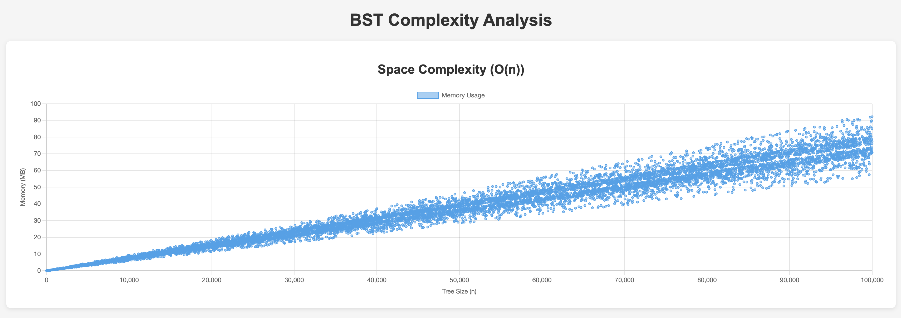
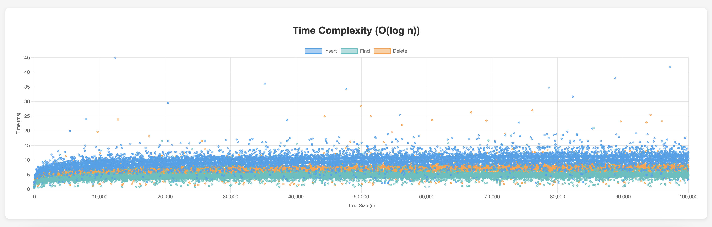

# Projector HSA Home work #22: Profiling

## Task:

1. Implement Balanced Binary Search Tree class and operations of insert/delete/search.
2. Profile space usage ( Confirm that you see O (n) )
3. Profile time consumption ( Confirm that you see O (log n))

BST is implemented in [balanced-bst.js](./balanced-bst.js)

To profile space usage run:

```bash
node profiling/profile-space-complexity.js
```

To profile time consumption run:

```bash
node profiling/profile-time-complexity.js
```

To see charts with complexity analysis run:

```bash
open visualization/complexity-charts.html
```

## Results:



